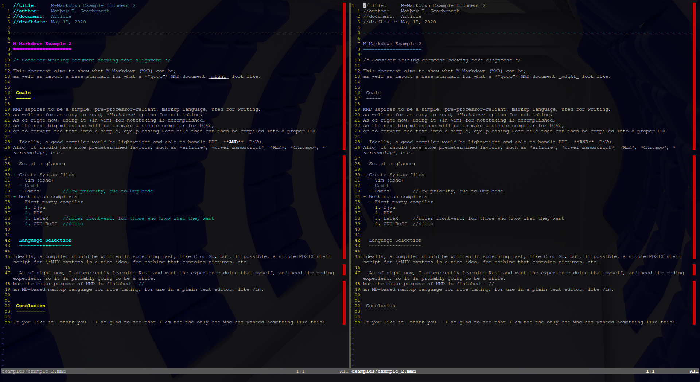

M-Markdown
==========

M-Markdown is a modern markup language, based upon the popular, intuitive, Markdown.
From note-taking to screenplays and novels, it specifically targets writers, who simply who want a plain-text, easy-to-read, elegant markup language for all of their projects.
It aims to be a general purpose markup language, chiefly with the intention of being compiled directly into portable document formats, such as Adobe's *PDF* or AT&T's *DjVu*.
To this end, where Markdown depends on CSS for complex styling, M-Markdown seeks to be able to allow the user to style things directly.

Goal
----

The ultimate goal of M-Markdown, is to be easy to read **before** being compiled,
but it would be nice for it to be an easier alternative to *ROFF* and *TeX* solutions.
So, while it does aim to be 100% backward compatible with normal Markdown, it also aims to push a new standard
(Which will be full effect with M-MD2.)

The most important immediate goal is to produce functional syntax highlighting packages for many popular editors;
namely, Vim.

The secondary goal is to produce a working standalone compiler or compilers.
Ideally in Rust and/or C/C++.
Something quick, lightweight, and extensible.

What's Different?
-----------------

The only things worth noting are modifications to heading syntax, as well as underline support, and distinction between lead and body paragraphs[^1].

1. Underline support is handled via removing interchangeability between asterisks (\*) and underlines (\_).

    _underlined text_

2. Basic heading syntax is built upon, not ovewritten--everything is the same.

    #H1        -- or --        Heading 1
                               =========
    ##H2       -- or --        Heading 2
                               ---------
    ###H3      -- or --        Heading 3    -- or --    #Heading 3
                               ~~~~~~~~~                ----------
    ####H4     -- or --        ##Heading 3
                               -----------
    etc.

3. Lead paragraphs are left un-indented.
Body paragraphs should be indented either with to spaces (\s\s) at the start of the line or a single tab (\t);
half that of what is needed to enter a `code` or `monospaced field.`

    | Example Section
    | ---------------
    |
    | This is an example sentence--it is completely meaningless
    | and only serves as an example, pupsuant to the context.
    |
    |   This is yet another example sentence--it also is meaningless
    | and serves as an example in the immediate context.

Some users may not want to worry about remembering indention, if not for that it is not good Markdown syntax.
Ideally, a compiler should be able to handle this automatically, with the ability to even remove distinction.

Also, though unimportant, MMD may highlight text by using the following for foreground colours:

    \\black" ... "   -- or -- \\black{ ... }
    \\blue" ... "    -- or -- \\blue{ ... }
    \\brown" ... "   -- or -- \\brown{ ... }
    \\green" ... "   -- or -- \\green{ ... }
    \\cyan" ... "    -- or -- \\cyan{ ... }
    \\red" ... "     -- or -- \\red{ ... }
    \\magenta" ... " -- or -- \\magenta{ ... }
    \\Yellow" ... "  -- or -- \\yellow{ ... }
    \\white" ... "   -- or -- \\white{ ... }
    \\grey" ... "    -- or -- \\grey{ ... }  -- or -- “gray” in place of “grey”

And for background colours:

    \\hiblack" ... "   -- or -- \\hiblack{ ... }
    \\hiblue" ... "    -- or -- \\hiblue{ ... }
    \\hibrown" ... "   -- or -- \\hibrown{ ... }
    \\higreen" ... "   -- or -- \\higreen{ ... }
    \\hicyan" ... "    -- or -- \\hicyan{ ... }
    \\hired" ... "     -- or -- \\hired{ ... }
    \\himagenta" ... " -- or -- \\himagenta{ ... }
    \\hiYellow" ... "  -- or -- \\hiyellow{ ... }
    \\hiwhite" ... "   -- or -- \\hiwhite{ ... }
    \\higrey" ... "    -- or -- \\higrey{ ... }  -- or -- “higray” in place of “higrey”

[^1]: **NOTE:** As of `v0.04` of the *Vim* syntax file, it does not have any support for Bode/Lead paragraph distinctions, as it has not been planned out yet.

How to Use the Syntax File(s)?
------------------------------

###Cloning the Repo

I recommend creating a directory in your `~/Downloads`, called `.src`, for all source code. but you may prefer to put it elsewhere.

1. `mkdir -p ~/Downloads/.src`
2. `git clone https://github.com/Matthew-Tate-Scarbrough/mmarkdown.git ~/Downloads/.src/mmarkdown`

 
###VIM

For Vim, simply do the following:

3. `cd ~/Downloads/.src/mmarkdown`
4. `mkdir -p ~/.vim/syntax`
5. `cp -f syntax/mmarkdown.vim ~/.vim/syntax/`

Now you have the option to either call the syntax highlighting in any file with `set syntax=mmarkdown` or...
add the following line to your `.vimrc`:

6. `vim ~/.vimrc`, then add the line: `au BufRead,BufNewFile *.mmd,*.txt set filetype=mmarkdown syntax=mmarkdown`

###NeoVim

For NeoVim, the process is similar to above

4. `mkdir -p ~/.config/nvim/syntax`
5. `cp -f syntax/mmarkdown.vim ~/.config/nvim/syntax/`
6. `nvim ~/.config/nvim/init.vim` and add: `au BufRead,BufNewFile *.mmd,*.txt set filetype=mmarkdown syntax=mmarkdown`

The Default Colour Scheme is Ugly
---------------------------------

Yes, but it works.
I plan on fixing it soon.
Though, I will mostlikely make it fit the Vim recommendations, and then you can use a good or custom theme, like *[Nord](https://github.com/arcticicestudio/nord)* or *[something](https://github.com/altercation/solarized)*...
